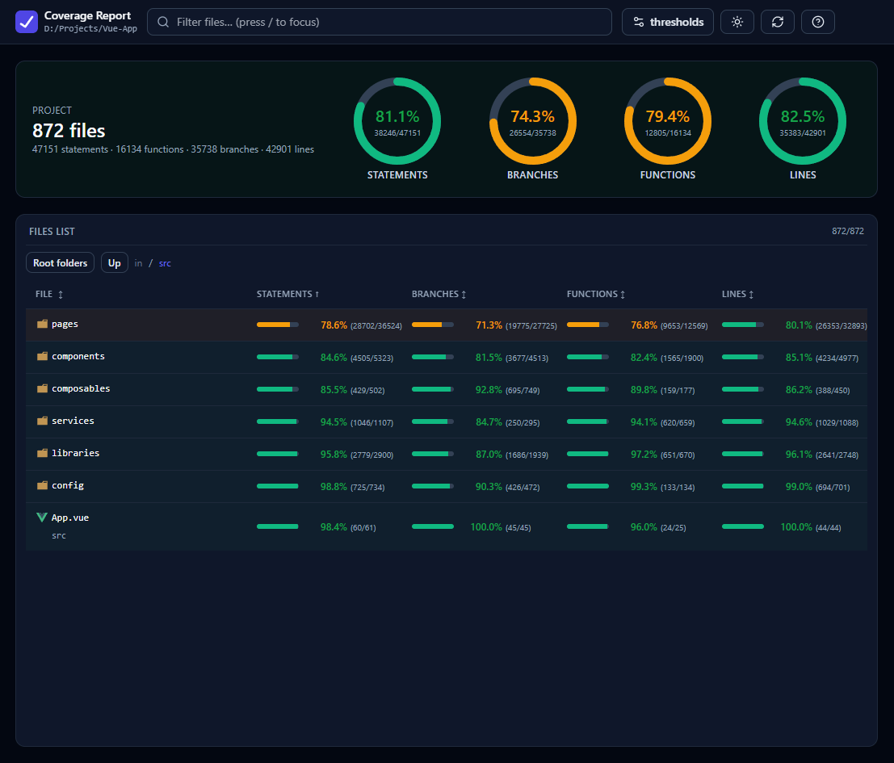
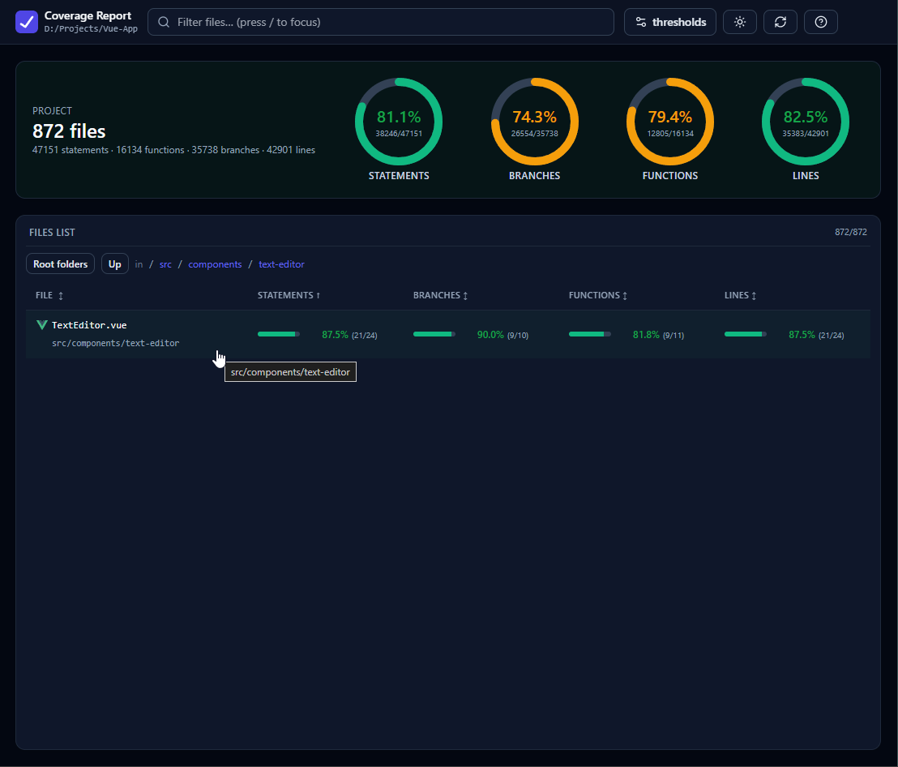
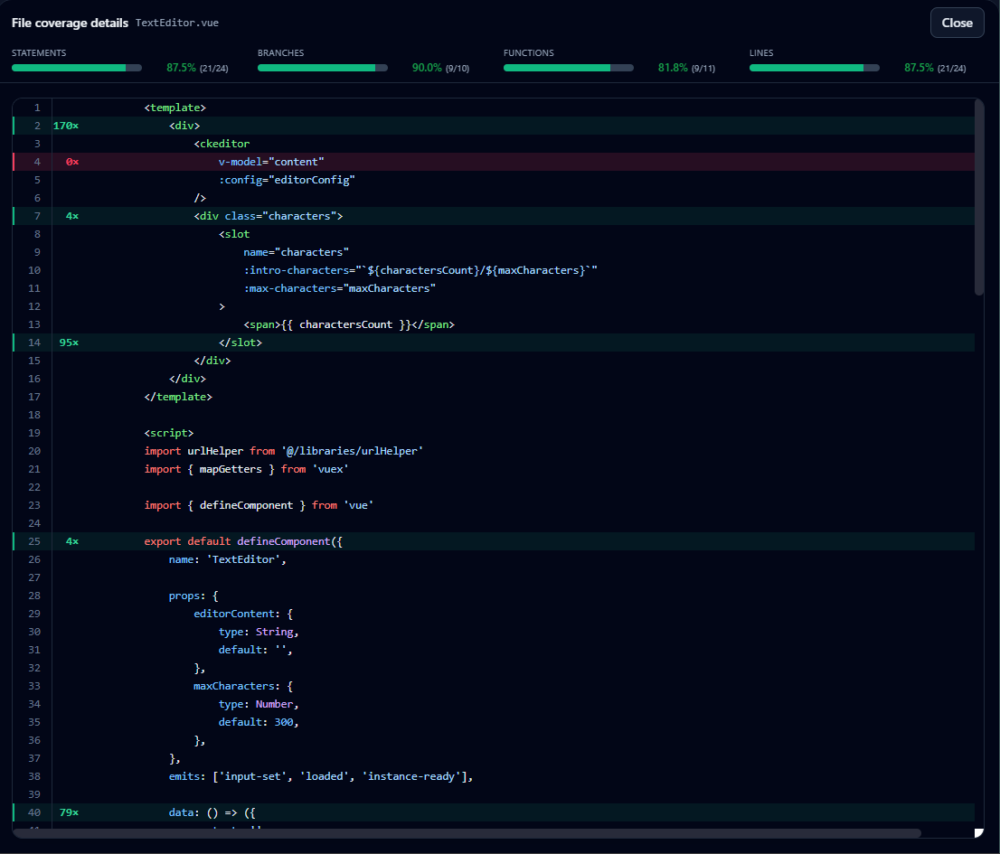

# Vitest Code Coverage Report

Modern self-hosted coverage viewer for Vitest/Istanbul JSON output
(`coverage/coverage-final.json`).

It provides:

- summary donuts for statements/branches/functions/lines
- collapsible folder tree with aggregated metrics
- sortable file list
- source drill-down with per-line hit/miss counts
- dark/light theme and keyboard shortcuts

## Screenshots

<p align="center">
  
  
</p>

<p align="center">
  
</p>

## Install

```bash
npm i -D vitest-code-coverage-report
```

## Quick start (any Vitest project)

1. Make sure Vitest emits JSON coverage:

```ts
// vitest.config.ts
import { defineConfig } from 'vitest/config'

export default defineConfig({
    test: {
        coverage: {
            reporter: ['json', 'html'],
        },
    },
})
```

2. Start the viewer (reads existing `coverage/coverage-final.json`; it does **not** run tests):

```bash
npx code-coverage-report
```

3. Optional: run tests with coverage, then open the viewer:

```bash
npx code-coverage-report --run-vitest
```

4. Optional: only some test files:

```bash
npx code-coverage-report --run-vitest -- App.spec.ts
```

The viewer defaults to `http://127.0.0.1:5179` (if that port is busy, the next free port is used).

## CLI options

```bash
code-coverage-report --root ./my-app --port 5180 --no-open
```

- `--root, -r <path>`: target project root (default: current directory)
- `--coverage-file, -c <path>`: explicit coverage JSON path
- `--port, -p <number>`: first port to try (default: `5179`; uses the next free port if busy)
- `--watch, -w`: run `vitest run --watch --coverage --coverage.reporter=json`, then keep the viewer open
- `--run-vitest`: run `vitest run --coverage --coverage.reporter=json` once, then start the viewer
- `--no-vitest`: do not run Vitest (this is the default)
- `--open` / `--no-open`: control browser auto-open
- `-- <args...>`: pass files/filters/options through to Vitest
- `--help, -h`: print usage help

### Command examples

Open the viewer only (use after `vitest --coverage` or your own `test:coverage` script):

```bash
npx code-coverage-report
```

Run tests once with coverage, then open viewer:

```bash
npx code-coverage-report --run-vitest
```

Run viewer + Vitest watch together:

```bash
npx code-coverage-report --watch
```

Filter to one spec while watching:

```bash
npx code-coverage-report --watch -- App.spec.ts
```

Explicit “viewer only” (same as default; useful in scripts for clarity):

```bash
npx code-coverage-report --no-vitest
```

## NPM script example

```json
{
    "scripts": {
        "coverage:report": "code-coverage-report",
        "coverage:run-and-report": "code-coverage-report --run-vitest",
        "coverage:watch-report": "code-coverage-report --watch"
    }
}
```

Then run:

```bash
npm run coverage:run-and-report -- App.spec.ts
```

## How coverage file discovery works

By default, the CLI uses the current working directory as project root and reads:

`<root>/coverage/coverage-final.json`

Use overrides when needed:

```bash
code-coverage-report --root ./apps/web
code-coverage-report --coverage-file ./artifacts/coverage/coverage-final.json
```

## Development

```bash
npm install
npm run build
npm run start
```
